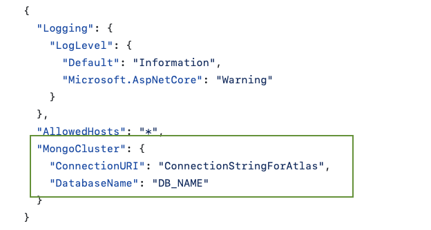

# PathPaver Backend
Clean Architecture ASP.NET Core project using .NET 8.0

## Requirements
- .NET 8.0

## Restore Packages
Same level of .sln
```sh
docker restore
```

## Add Cluster infor in appsettings.json
The file is located in the **_PathPaver.Web_**


## Domain Layer 
the project that contains the domain layer, including the entities, value objects, and domain services

## Application Layer 
the project that contains the application layer and implements the application services, DTOs (data transfer objects), and mappers. It should reference the Domain project.

## Infrastructure Layer 
The project contains the infrastructure layer, including the implementation of data access, logging, email, and other communication mechanisms. It should reference the Application project.

## Presentation Layer 
The main project contains the presentation layer and implements the ASP.NET Core web API. It should reference the Application and Infrastructure projects.
